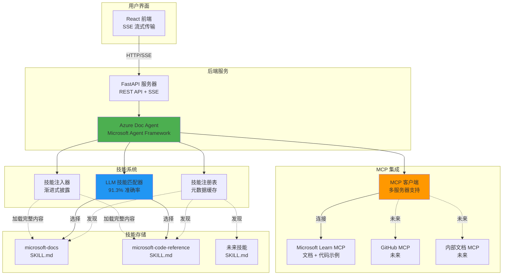
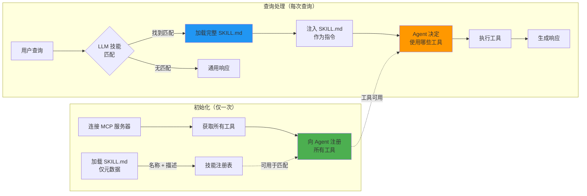
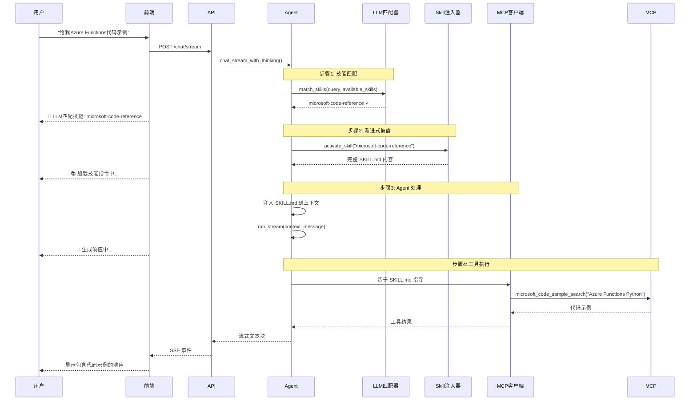

# 使用 Microsoft Agent Framework、Agent Skills 和 MCP 构建智能文档助手

## 引言

由Anthropics开放的Claude agent skills无疑是当下最火的Agentic技术。各大AI开发助理厂商也都跟进，你可以利用Claude code agent SDK或者其他厂商的SDK来实现这个功能，或者在AI开发助理软件中直接使用。但它本是一个开放标准，你可以利用这个思想，参考这个文档自主开发实现这个能力。另外也通过本篇文章的实际例子来阐述Agent Skills和MCP的区别，和如何配合使用。

Agent Skills文档：
https://agentskills.io

此Agent主要结合了三项技术来实现智能Azure文档助手，无需最复杂的RAG：

- **Microsoft Agent Framework (MAF)** - 企业级 Agent 编排框架
- **Agent Skills** - 模块化、可发现的能力系统  
- **Model Context Protocol (MCP)** - 标准化工具集成协议

最终实现了一个可扩展的智能 Agent，能够理解用户意图、动态激活相关技能，并利用适当的工具提供准确的文档帮助。

## 架构概览

### 系统架构

完整的系统架构整合了前端、后端、Skills系统和MCP服务器，提供智能文档帮助。



### 渐进式披露设计

Skills的核心架构原则是**渐进式披露**（Progressive Disclosure），在三个层次上实现：



### 关键洞察：SKILL.md 作为工具使用指南

**关键设计决策**：我们不是有条件地将工具传递给 Agent，而是在初始化时注册所有 MCP 工具，让 **SKILL.md 内容指导使用哪些工具**。

这使得：
- 多个 MCP 服务器可以在一个系统中共存
- 不同的技能指导不同的工具使用
- 轻松添加新技能和 MCP 集成
- 完全分离工具可用性与工具选择

## 组件深入解析

### 1. Microsoft Agent Framework 集成

MAF 提供企业级 Agent 编排能力：

**使用的关键特性**：
- 通过 `run_stream()` 流式响应
- 多轮对话的线程管理
- 通过 `MCPStreamableHTTPTool` 集成工具

### 2. Agent Skills 系统

Agent Skills 遵循 [agentskills.io](https://agentskills.io) 标准，并有一个自定义增强：**基于 LLM 的技能匹配**。


#### 通过LLM语义识别问题
```python
# ✅ 解决方案：语言无关、理解意图
matched_skill = await llm_matcher.match_skills(
    user_query="我想了解Cosmos DB的分区机制",
    available_skills=skills
)
# → 匹配：microsoft-docs
```

**优势**：
- 支持任何语言或表达方式
- 理解意图，而不仅仅是关键词
- 无需手动维护关键词
- 关键词匹配作为回退，增强鲁棒性

## 查询处理流程

让我们通过一个真实查询来演示：



**用户查询**: "给我Azure Functions的Python代码示例"

### 步骤 1：LLM 技能匹配
```
可用技能：
  - microsoft-docs: "查询官方文档..."
  - microsoft-code-reference: "查找代码示例和 API 参考..."

LLM 分析：
  用户想要：代码示例
  最佳匹配：microsoft-code-reference ✓
```

### 步骤 2：渐进式披露
```
加载完整的 SKILL.md：
  
  ## 工具
  | 工具 | 用途 |
  |------|------|
  | microsoft_code_sample_search | 查找可工作的代码示例 |
  
  ## 何时使用
  - 用户请求代码示例
  - 需要 API 参考示例
  - 需要 SDK 使用模式
```

### 步骤 3：SKILL.md 注入
```python
context_message = f"""
{SKILL.md 内容}

用户问题：给我Azure Functions的Python代码示例
"""

stream = agent.run_stream(context_message)
```

### 步骤 4：Agent 工具选择
Agent 读取 SKILL.md，理解：
- "用户想要代码示例"
- "我应该使用 microsoft_code_sample_search"
- 执行工具 → 返回结果


## 结论

本项目展示了如何通过结合以下技术构建生产级智能 Agent：

- **Microsoft Agent Framework** 提供强大的编排能力
- **Agent Skills** 提供模块化能力管理
- **MCP** 提供标准化工具集成
- **基于 LLM 的智能** 

## 资源

- **GitHub 仓库**: [您的仓库 URL]
- **Microsoft Agent Framework**: [agent-framework PyPI](https://pypi.org/project/agent-framework/)
- **Agent Skills 标准**: [agentskills.io](https://agentskills.io)
- **Model Context Protocol**: [MCP 规范](https://modelcontextprotocol.io/)

---

*使用 Microsoft Agent Framework、React 和 FastAPI 构建*
